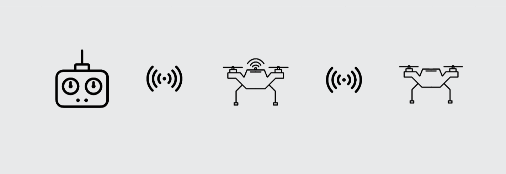

## ✈️드론의 비행 거리를 늘려보자[중계 통신 드론 프로젝트]


## 중계 통신 드론이란?

- **중계 드론**은 일반 학생들이 저렴하게 드론을 제작하고 SW코딩 학습과 더불어 드론의 비행 거리를 늘리는데 목적이 있습니다.

- 중계 통신을 이해하기 쉬운 예는 휴대전화 입니다. 저희가 상대방과 전화를 할 수 있는 이유는 기지국이 중계소 역할을 해주는 덕분입니다.

- 조종기와 드론 사이에 중계소 역할을 하는 드론을 제작하는 것이 중계 드론 프로젝트 입니다.

- 드론 시뮬레이터를 제작하여 문서에서 제작한 조종기를 사용하여 드론 조종 훈련이 가능합니다.


<br>




## 바로가기
1. [중계 통신 드론이란?](#중계-통신-드론이란)

2. [바로가기](#바로가기)
    - [준비물](#준비물)
    - [회로도](#회로도)
    - [드론 제작에 앞서](#드론-제작에-앞서)
    - [제작 과정](#제작-과정)
    - [문서](#문서)

3. [중계 드론 빌드 방법 PDF](https://drive.google.com/file/d/1Zqlsaz8OV26cVhaoOtoAvIVqaOmRjo3B/view?usp=sharing)

4.  [드론 시뮬레이터 다운로드](https://drive.google.com/file/d/1ymEPB1GEQYfEJyJiITfJfxDNSJ_VvF2R/view) 설정 방법은 문서를 참고
 
<br>

## 준비물
>준비물 예시 입니다. 방식만 같거나 비슷하다면 다른 더욱 좋은 솔루션이 있을 수 있습니다.

### 준비
- ESP32 **(필수)**
- ATmega328 **(필수)**
- Nrf24l01 **(필수)**
- 10μF커페시터(안전성을 높여줍니다.)
- GY-521(MPU6050) **(필수)**
- 스텝다운 모듈 혹은 레귤레이터
- 조이스틱 혹은 조종기(조종기는 내부를 제거하고 조이스틱을 사용합니다. 고장난 조종기를 추천) **(필수)**
- 토글 스위치 **(필수)**
- 헤더 핀 소켓
- 3mm 인서트 너트
- 진동 방지용 댐퍼 **(필수)**
- F450 드론 프레임 **(필수)**
- 모터와 ESC (ESC용량에 주의해 주세요.) **(필수)**
- 배터리와 프롭 **(필수)**

혹은 다른 프레임을 준비해도 괜찮습니다. 또한, 폴더에 F450 규격에 프레임 출력 파일이 있습니다. 높은 추력과 효율을 위해서는 모터, 배터리, 프롭을 고려해 알맞은 제품을 구해야 합니다. **문서에서는 효율에 대한 내용을 다루지 않습니다.**

<br>

## 회로도
  >회로는 조종기, 중계 드론, 메인 드론 3가지 입니다.

### 조종기
<br>

### 중계 드론
<br>

### 메인 드론
<br>

### 시뮬레이터 수신기
<br>
수신기는 위에 제작한 중계 드론과 메인 드론 회로와 동일합니다. 따라서 두 드론 중 하나를 사용하여 소스코드를 업로드하는 것으로 시뮬레이터 수신기로 사용이 가능합니다.

<br>

## 드론 제작에 앞서
  - ### 전압 분배
    ESP32와 아두이노 보드 전원공급을 드론 배터리로 해결 합니다. 따라서 드론의 14.8V 혹은 다른 용량의 배터리 전압을 낮춰줄 필요가 있습니다. 위 회로에서는 9V로 정하였지만 **사용하는 보드에 입력 전압을 숙지하고 그에 맞춰서 조정**하길 바랍니다.
  <br>
  <br>
  배터리 전원은 ESC, ESP32, 아두이노 등으로 전달 되어야 하기에 적절한 분배 장비를 이용해야 합니다.<br><br>
  
&nbsp;&nbsp;&nbsp;&nbsp;&nbsp;&nbsp;&nbsp;&nbsp;&nbsp;&nbsp;- 전원 분배 보드


  &nbsp;&nbsp;&nbsp;&nbsp;&nbsp;&nbsp;&nbsp;&nbsp;&nbsp;&nbsp;- 바디 전원 분배


  &nbsp;&nbsp;&nbsp;&nbsp;&nbsp;&nbsp;&nbsp;&nbsp;&nbsp;&nbsp;- 기타 등등...

  - ### 전압 조정
    전압 조정 방법 또한 여러 방법이 있습니다.
    <br>
    BEC, 레귤레이터, 스텝다운 등등..
    <br>
    이 문서에서는 스텝다운 모듈을 사용하여 전압을 낮추어 아두이노 보드에 입력합니다.<br>
    <br>

    <br>

    
  
  <br>

  - ### Multiwii
    Multiwii는 드론 제작에 많이 사용되는 FC(Flight Controller) 소프트웨어입니다.
    Multiwii는 오픈 소스 프로젝트로서, 사용자들이 자유롭게 소스 코드를 수정하거나 개선할 수 있습니다. 개인적인 프로젝트부터 상업적인 제품까지, 다양한 범위에서 사용될 수 있습니다.<br>
    아래 링크를 통해 Multiwii를 다운로드하여 사용합니다.
  <br>
  <br>
  ```
  http://www.multiwii.com/
  ```
  <br>
  <br>
  <br><br>
  
  

## 제작 과정

  - ### ESP32와 Nrf24l01 10μF커패시터 납땜
    >필수는 아니지만 편의성과 안정성을 위해서 진행하는 것을 추천합니다.<br>

    <br>

    - 커패시터 납땜 위치를 확인하세요.
    - ESP32 EN 단자와 GND를 연결해야 합니다.<br>

    <br>

    - 위 처럼 연결해도 괜찮지만 너무 단자가 길어집니다. 여기서는 아래와 같이 직접 연결을 하여 공간을 최소화 하겠습니다.<br>

    <br>

    - 커패시터 단자 + - 를 확인하세요.<br>

    <br>
    <br>

    - 위 와 같은 모습을 만들었으면 성공입니다. 다시 언급하지만 위와 똑같이 진행 할 필요는 없습니다.<br>

  - ### 조종기 제작
    
    조종기 제작은 두 가지 방법이 있습니다.

    1. 실제 조종기 혹은 고장난 조종기 기판을 제거하고 사용하기.

    2. 브레드보드 혹은 만능기판에 회로를 구성하여 사용하기.

    회로도를 위에 게시해 두었으니 회로 제작은 넘어가겠습니다.
    아래는 제작된 조종기 두 가지 버전입니다.

    #### 조종기 ver.1
    <br>

    <br>

    #### 조종기 ver.2
    <br>

  - ### MPU6050 설치 과정
    mpu6050은 수평을 유지시키기 위한 핵심 부품 입니다. 비행시 mpu6050에 문제가 생기지 않게 댐퍼와 출력물을 사용해 mpu6050을 고정해야 합니다.

    재료를 준비합니다.<br>
    CAD폴더에서 mpu6050 관련 출력물을 출력해 사용합니다. 직접 설계하거나 다른 방법을 사용해도 괜찮습니다. **mpu6050에 이상이 생기지 않게 하는 작업임을 인지해 주세요.**
    

    

    ※ 해당 출력물은 헤더소켓을 끼웠을 때 고정되는 길이로 제작되었습니다.<br>
    인서트 너트를 넣고 조립 준비를 합니다.

    

    비행시 생기는 진동에 대비하도록 댐퍼 위에 mpu6050을 설치하여 마무리 합니다.

    

<br>

## 문서

  이후 모든 작업에 대한 설명은 아래 문서에 기술

[중계 드론 빌드 방법 PDF](https://drive.google.com/file/d/1Zqlsaz8OV26cVhaoOtoAvIVqaOmRjo3B/view?usp=sharing)