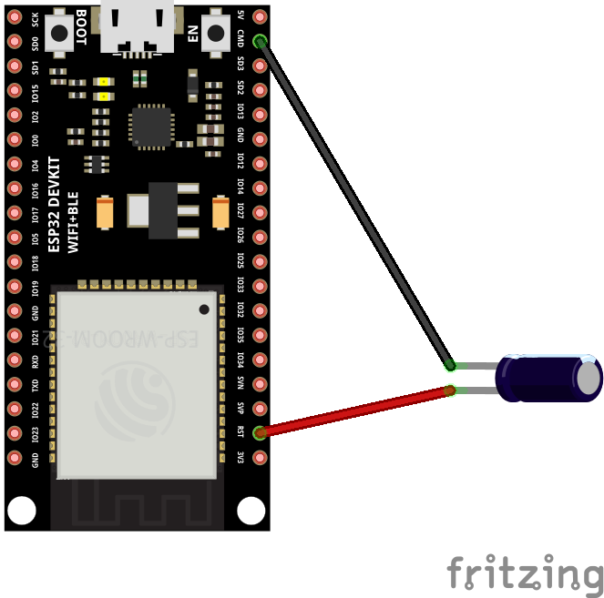
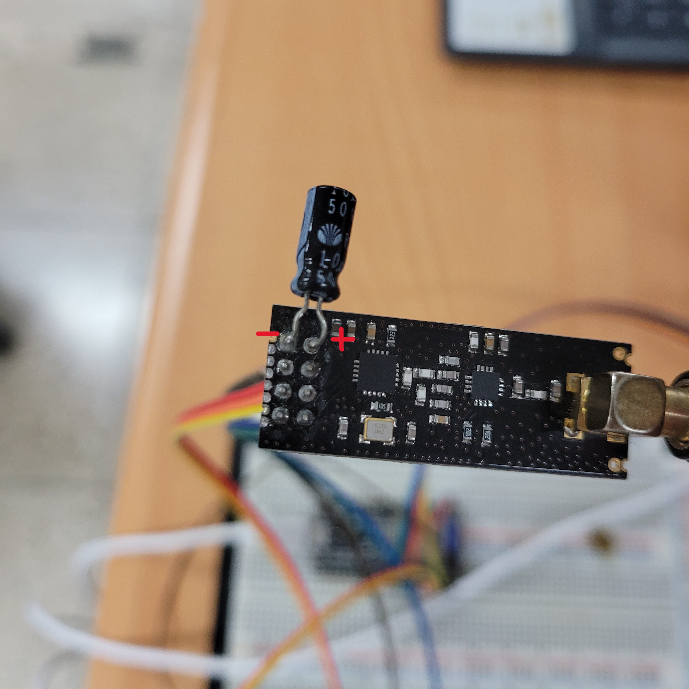
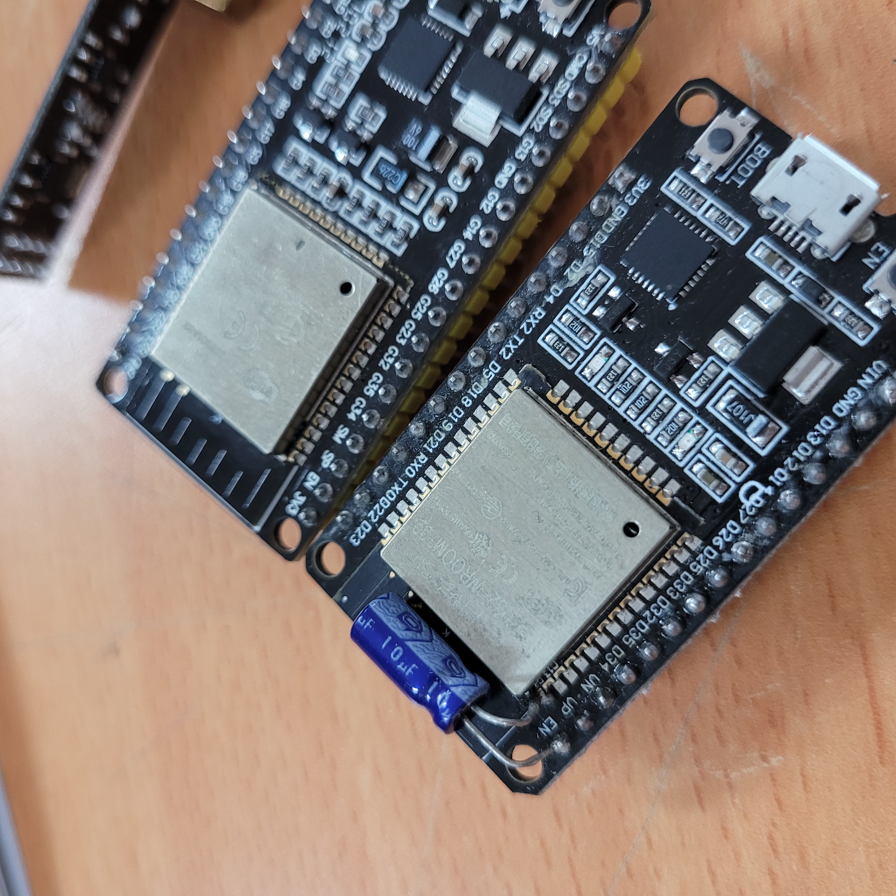

## ✈️드론의 비행 거리를 늘려보자[중계 통신 드론 프로젝트]

## 중계 통신 드론이란?

- **중계 드론**은 **<u>일반 학생들이 저렴하게 드론을 제작하고 SW코딩 학습과 더불어 드론의 비행 거리를 늘리는데 목적이 있습니다.

- 중계 통신을 이해하기 쉬운 예는 휴대전화 입니다. 저희가 상대방과 전화를 할 수 있는 이유는 기지국이 중계소 역할을 해주는 덕분입니다.

- 조종기와 드론 사이에 중계소 역할을 하는 드론을 제작하는 것이 중계 드론 프로젝트 입니다.

## 바로가기
1. [중계 통신 드론이란?](#중계-통신-드론이란)

2. [바로가기](#바로가기)
    - [준비물](#준비물)
    - [회로도](#회로도)
    - [제작 과정](#제작-과정)
    - [테스트](#테스트)

 
 

## 준비물
>준비물 예시 입니다. 방식만 같거나 비슷하다면 다른 더욱 좋은 솔루션이 있을 수 있습니다.

### 준비
- ESP32
- ATmega328
- Nrf24l01
- 10μF커페시터(안전성을 높여줍니다.)
- GY-521(MPU6050)
- 스텝다운 모듈 혹은 레귤레이터
- 조이스틱 혹은 조종기(조종기는 내부를 제거하고 조이스틱을 사용합니다. 고장난 조종기를 추천)
- 토글 스위치

 

## 회로도
  >회로는 조종기, 중계 드론, 메인 드론 3가지 입니다.

### 조종기

### 중계 드론

### 메인 드론

 

## 제작 과정

  - ### ESP32와 Nrf24l01 10μF커패시터 납땜
    >필수는 아니지만 편의성과 안정성을 위해서 진행하는 것을 추천합니다.

    

    - 커패시터 납땜 위치를 확인하세요.
    - ESP32 EN 단자와 GND를 연결해야 합니다.

    

    - 위 처럼 연결해도 괜찮지만 너무 단자가 길어집니다. 여기서는 아래와 같이 직접 연결을 하여 공간을 최소화 하겠습니다.

    

    - 커패시터 단자 + - 를 확인하세요.

    
    

    - 위 와 같은 모습을 만들었으면 성공입니다. 다시 언급하지만 위와 똑같이 진행 할 필요는 없습니다.

  - ### 조종기 제작
    
    조종기 제작은 두 가지 방법이 있습니다.

    1. 실제 조종기 혹은 고장난 조종기 기판을 제거하고 사용하기.

    2. 브레드보드 혹은 만능기판에 회로를 구성하여 사용하기.

    회로도를 위에 게시해 두었으니 회로 제작은 넘어가겠습니다.
    아래는 제작된 조종기 두 가지 버전입니다.

    #### 조종기 ver.1
    

    

    #### 조종기 ver.2
    

    

  - ### 중계기 제작
    사진

  - ### 메인기 제작
    사진

 

## 테스트

  사진
